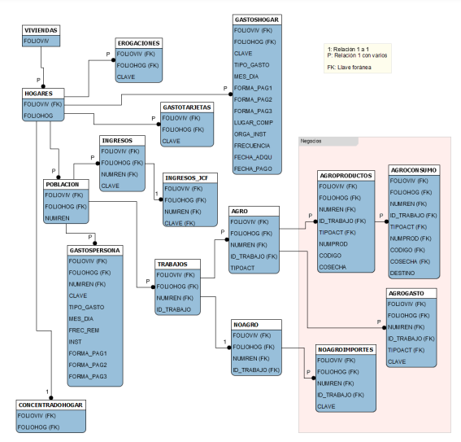
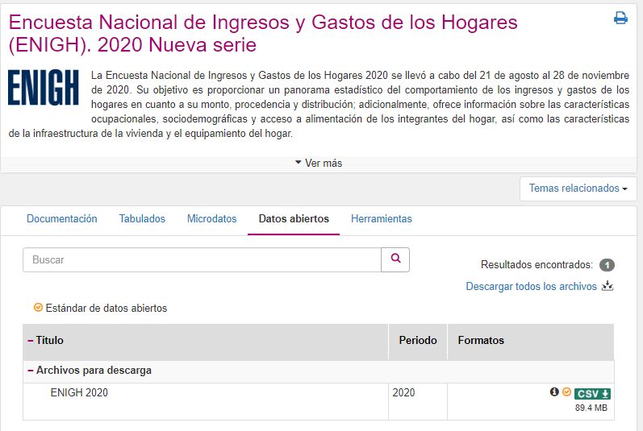
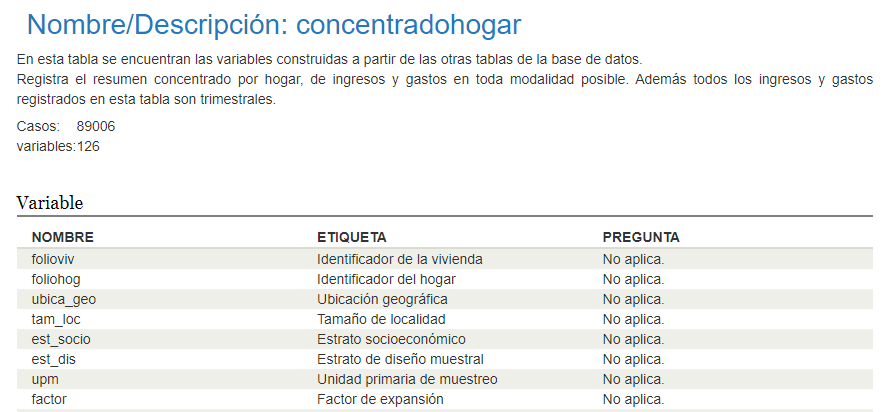
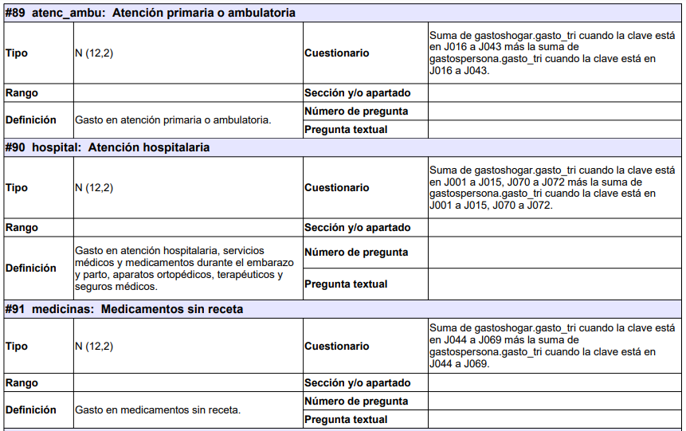
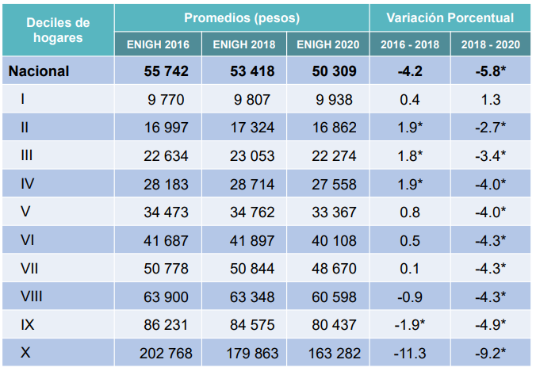
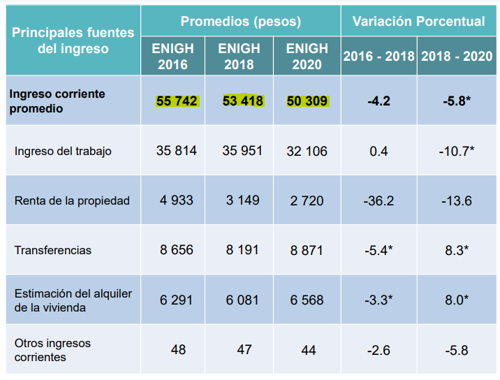

<style type="text/css">

body, td {
   font-size: 20px;
}
code.r{
  font-size: 20px;
}
pre {
  font-size: 20px
}
</style>

```{r setup, include=FALSE}
knitr::opts_chunk$set(echo = T, message=F, warning=F)
library(tidyverse)
library(usethis)
library(here)
library(srvyr)
library(knitr)
```

## ¿Qué esperar de esta mentoría?

- Enfoque en la ENIGH 2020
- Explicación conceptual de los conceptos relevantes para el *challenge*
- No es un tutorial de código pero se utiliza (y muestra) el código en  `R` (aunque no se explicará con detalle)
- El código está disponible en el repo [animalito/microtaller-dm](https://github.com/animalito/microtaller-dm)


## Diagrama entidad relación ENIGH 2020



[Descriptor de archivos, p. 6](https://inegi.org.mx/contenidos/productos/prod_serv/contenidos/espanol/bvinegi/productos/nueva_estruc/889463901242.pdf)

## [Datos abiertos](https://inegi.org.mx/programas/enigh/nc/2020/#Datos_abiertos)



## [Concentrado hogar](https://www.inegi.org.mx/rnm/index.php/catalog/685/data-dictionary/F28?file_name=concentradohogar)



## Concentrado hogar

Interesan las variables:

- `salud` Cuidados de la salud
- `atenc_ambu` Atención primaria o ambulatoria
- `hospital` Atención hospitalaria
- `medicinas` Medicamentos sin receta

Además de todas las variables de diseño (`est_dis`, `upm`, `factor`).

## Lectura base

```{r}
if(!file.exists("datos/conjunto_de_datos_enigh_ns_2020_csv")){
  use_zip("https://inegi.org.mx/contenidos/programas/enigh/nc/2020/datosabiertos/conjunto_de_datos_enigh_ns_2020_csv.zip", "datos", cleanup = T)
}
```

```{r}
ch <- read_csv(here("datos", 
    "conjunto_de_datos_enigh_ns_2020_csv", 
    "conjunto_de_datos_concentradohogar_enigh_2020_ns",
    "conjunto_de_datos",
    "conjunto_de_datos_concentradohogar_enigh_2020_ns.csv"))
ch
```

## Declaramos el diseño

```{r}
ch_d <- ch %>% 
    as_survey_design(ids = upm, weights = factor, strata = est_dis)

ch_d

ch_d %>% 
    srvyr::group_by(sexo_jefe) %>% 
    srvyr::summarise(mean_ingcor = survey_mean(ing_cor))
```

## Sanity check - gasto en salud

En la presentación de resultados de la ENIGH 2020, se establece que
*el rubro de cuidados de la salud obtuvo 1,266 pesos.*.

```{r}
ch_d %>% 
    srvyr::summarise(salud = survey_mean(salud))
```


## Estados 

```{r}
ubicageo <- read_csv(here("datos", 
    "conjunto_de_datos_enigh_ns_2020_csv", 
    "conjunto_de_datos_concentradohogar_enigh_2020_ns",
    "catalogos",
    "ubica_geo.csv"))

ch <- dplyr::left_join(
  ch, ubicageo
)

# regeneramos diseño
ch_d <- ch %>% 
    as_survey_design(ids = upm, weights = factor, strata = est_dis)
```

Generamos los datos por estado para el ingreso corriente, gasto monetario, salud, atención ambulatoria, hospital, medicinas.

```{r, cache = T}
e <- ch_d %>% 
    srvyr::group_by(desc_ent) %>% 
    srvyr::summarise(
      m.ingcor = survey_mean(ing_cor),
      m.gasto_mon = survey_mean(gasto_mon),
      m.salud = survey_mean(salud),
      m.atenc_ambu = survey_mean(atenc_ambu),
      m.hospital = survey_mean(hospital),
      m.medicinas = survey_mean(medicinas)
      )
e
```

## [% gasto](https://r-graph-gallery.com/267-reorder-a-variable-in-ggplot2.html)

```{r}
e %>%
  mutate(
    pg.salud = m.salud / m.gasto_mon * 100
  ) %>%
  mutate(desc_ent = fct_reorder(desc_ent, pg.salud)) %>%
  ggplot( aes(x = desc_ent, y = pg.salud)) +
    geom_bar(stat="identity", fill="#f68060", alpha=.6, width=.4) +
    coord_flip() +
    xlab("") + ylab("Gasto en salud (como % del gasto total)") +
    theme_bw()
```

## Variables de salud

Distribución por estado en [gráfico de barras agrupado](https://r-graph-gallery.com/48-grouped-barplot-with-ggplot2.html).

```{r}
ch %>% 
  mutate(
    suma = atenc_ambu + hospital + medicinas - salud
  ) %>%
  select(suma, salud, atenc_ambu, hospital, medicinas)

g.e <- e %>%
  select(!ends_with("_se"), -m.ingcor, -m.gasto_mon) %>%
  gather(., key = "tipo", value = "valor", -desc_ent, -m.salud) %>%
  mutate(
    porcentaje = valor/m.salud * 100
  )

g.e 

g.e %>%
  ggplot(., aes(fill = tipo, y = porcentaje, x = desc_ent)) + 
    geom_bar(position = "stack", stat = "identity") +
    coord_flip() +
    theme_bw()


# No se necesita pre calcular el porcentaje
# ggplot2 lo hace por ti
ggplot(g.e, aes(fill = tipo, y=valor, x=desc_ent)) + 
    geom_bar(position="fill", stat="identity") +
    coord_flip() +
    theme_bw()

```

## Gasto persona - gasto hogar


*Nota 1* Gasto persona y gasto hogar son excluyentes (consideran gastos distintos), por lo que se tienen que sumar para llegar al gsato monetario trimestral que considera el `concentrado_hogar`.

*Nota 2* `gastotarjetas` considera los gastos que ya son reportados en `gastopersona` y en `gastohogar` para especificar si fueron realizados con tarjeta, es decir, **no se suman**.

*Nota 3* Las claves de gasto no tienen un factor de expansión. En las de hogar es transparente, es decir, pegas el factor de expansión del hogar. En el de personas también se hereda el factor de expansión del hogar pero considera que los números de cuadre son los de nivel persona.

Ahora, los gastos en salud del concentrado del hogar se definen como se muestra en la siguiente figura [tomada del descriptor de archivos, p. 194](https://inegi.org.mx/contenidos/productos/prod_serv/contenidos/espanol/bvinegi/productos/nueva_estruc/889463901242.pdf).



```{r}
gp <- read_csv(here("datos", 
    "conjunto_de_datos_enigh_ns_2020_csv", 
    "conjunto_de_datos_gastospersona_enigh_2020_ns",
    "conjunto_de_datos",
    "conjunto_de_datos_gastospersona_enigh_2020_ns.csv"))

gp

gh <- read_csv(here("datos", 
    "conjunto_de_datos_enigh_ns_2020_csv", 
    "conjunto_de_datos_gastoshogar_enigh_2020_ns",
    "conjunto_de_datos",
    "conjunto_de_datos_gastoshogar_enigh_2020_ns.csv"))

gh

```

## Sanity check - a totales

```{r}
# Sumando gasto trimestral en las claves J de las tablas de gasto
bind_rows(gp, gh) %>%
  filter(str_starts(clave, "J")) %>%
  group_by(folioviv, foliohog) %>%
  summarise(salud_gasto = sum(gasto_tri, na.rm = T)) %>%
  ungroup() %>% 
  left_join(ch) %>% # ¡Aguas! No te va a cuadrar a medias (faltan ceros)
  mutate(suma = salud_gasto * factor) %>%
  summarise(suma.tablas.gasto = sum(suma, na.rm = T))

# Sumando el gasto en salud
ch %>%
  mutate(suma = salud * factor) %>%
  summarise(suma.concentrado.hogar = sum(suma, na.rm = T))
```

## Sanity check - a medias

```{r}
tot.gastos <-
  bind_rows(gp, gh) %>%
  filter(str_starts(clave, "J")) %>%
  group_by(folioviv, foliohog) %>%
  summarise(salud_gasto = sum(gasto_tri, na.rm = T)) %>%
  ungroup() %>% 
  right_join(ch) %>%
  mutate(salud_gasto = replace_na(salud_gasto, 0))

tot.gastos_d <- tot.gastos %>% 
    as_survey_design(ids = upm, weights = factor, strata = est_dis)

tot.gastos_d %>% 
    srvyr::summarise(mean_salud_gasto = survey_mean(salud_gasto))


ch_d %>%
  srvyr::summarise(salud = survey_mean(salud))


```

*Nota* Es **muy importante** que si trabajan las tablas de gasto a nivel de clave consideren los intervalos de confianza en sus estimaciones. Las varianzas son **importantes** y deberán hacer pruebas de hipótesis adecuadas.

[En esta referencia](https://www.inegi.org.mx/contenidos/investigacion/invenc/doc/01_Analisis.pdf) (p. 42-94) pueden ver un análsis usando estadística descriptiva y pruebas de hipótesis para analizar claves de gasto considerando las varianzas en las estimaciones.


## Claves de gasto

Las claves de gasto asociadas a salud, contienen información muy detallada de los gastos específicos en los hogares.

```{r}
cat.gastos <- read_csv(here("datos", 
    "conjunto_de_datos_enigh_ns_2020_csv", 
    "conjunto_de_datos_gastospersona_enigh_2020_ns",
    "catalogos",
    "gastos.csv"))

cat.gastos %>% 
  filter(str_starts(gastos, "J")) %>%
  kable(.)
```

*Nota 1* Los cubrebocas están en la clave J060 si son desechables; si son cubrebocas de tela, se registran en la clave H131. 

*Nota 2* Gel antibacterial se registra en la J061.

## Creamos deciles

Es usual que los datos de la ENIGH se muestren en deciles de ingreso, es decir, se establecen $10$ grupos con el mismo número de hogares y se asigna al primer grupo el $10%$ de hogares con menor ingreso(*primer decil*); al segundo grupo el $10%$ de hogares con el siguiente orden de ingreso, etc.

```{r}
# Importamos función auxiliar para crear deciles
source("lib/crea_cortes_eco.R")

deciles <- ch %>%
  select(folioviv, foliohog, factor, upm, est_dis, ing_cor) %>%
  corte.economico(., variable.ref = "ing_cor", pesos = "factor",
                  cortes = 10, nombre = "deciles", prefijo = "d")
```

## Sanity check - deciles

En la [presentación de resultados, lámina 20](https://inegi.org.mx/contenidos/programas/enigh/nc/2020/doc/enigh2020_ns_presentacion_resultados.pdf) obtenemos datos para checar nuestros resultados:



```{r, cache = T}
deciles_d <- deciles %>% 
    as_survey_design(ids = upm, weights = factor, strata = est_dis)

deciles_d %>% 
    srvyr::group_by(deciles) %>% 
    srvyr::summarise(m.ingcor = survey_mean(ing_cor))
```
Así, tenemos las medias del ingreso corriente trimestral para cada *decil* de ingreso.

## Deflactar

Cuando realizamos comparaciones intertemporales de variables que están en pesos, es importante deflactarlas para tener precios constantes (es decir, se busca "*quitar*" el efecto de la inflación para poder comparar el fenómeno que de hecho nos interesa, en este caso el gasto en salud).

En el siguiente ejercicio se muestra como llevar a precios 2020 la variable de `ing_cor` de los años 2016 y 2018.

Para ello usaremos los siguientes deflactores:

```
De 2016 a 2020 es: 1.19197241224101
De 2018 a 2020 es: 1.07156302941117
```

```{r}
# Borramos todo en el ambiente
rm(list = ls())

# Necesitamos considerar todos los decimales
options(scipen = 999, digits = 12)

# Tabla con deflactores
deflactores <- tibble(
  anio = c("2016", "2018", "2020")
  , deflactor = c(1.19197241224101, 1.07156302941117, 1),
  stringsAsFactors = F
)
```

Descargamos las bases de 2016 y 2018.

```{r}
# Bajamos 2018 (si no existe)
if(!file.exists("datos/conjunto_de_datos_enigh_2018_ns_csv")){
  use_zip("https://inegi.org.mx/contenidos/programas/enigh/nc/2018/datosabiertos/conjunto_de_datos_enigh_2018_ns_csv.zip", "datos", cleanup = T)
}

# Bajamos 2016 (si no existe)
if(!file.exists("datos/conjunto_de_datos_enigh2016_nueva_serie_csv")){
  use_zip("https://inegi.org.mx/contenidos/programas/enigh/nc/2016/datosabiertos/conjunto_de_datos_enigh2016_nueva_serie_csv.zip", "datos", cleanup = T)
}

```

Cargamos el contentrado del hogar para los 3 años.

```{r}

ch <- bind_rows( 
  bind_rows(
  # 2020
  mutate(read_csv(here("datos", 
    "conjunto_de_datos_enigh_ns_2020_csv", 
    "conjunto_de_datos_concentradohogar_enigh_2020_ns",
    "conjunto_de_datos",
    "conjunto_de_datos_concentradohogar_enigh_2020_ns.csv")),
    anio = "2020"),
  # 2018
  mutate(read_csv(here("datos", 
    "conjunto_de_datos_enigh_2018_ns_csv",
    "conjunto_de_datos_concentradohogar_enigh_2018_ns",
    "conjunto_de_datos",
    "conjunto_de_datos_concentradohogar_enigh_2018_ns.csv")),
    anio = "2018")),
  # 2016
  mutate(read_csv(here("datos", 
    "conjunto_de_datos_enigh2016_nueva_serie_csv", 
    "conjunto_de_datos_concentradohogar_enigh_2016_ns",
    "conjunto_de_datos",
    "conjunto_de_datos_concentradohogar_enigh_2016_ns.csv")),
    anio = "2016")
)
```

Deflactamos `ing_cor`, extraemos la media por decil y revisamos contra la [presentación de resultados 2020, lámina 17](https://inegi.org.mx/contenidos/programas/enigh/nc/2020/doc/enigh2020_ns_presentacion_resultados.pdf):



```{r}

left_join(ch, deflactores) %>%
  mutate(ing_cor.d = ing_cor * deflactor) %>%
  group_by(anio) %>%
  dplyr::summarise(ing_cor_media = weighted.mean(x = ing_cor.d, w = factor))


```

## Comparaciones intertemporales

```{r}
left_join(ch, deflactores) %>%
  mutate(ing_cor.d = ing_cor * deflactor) %>%
  group_by(anio) %>%
  dplyr::summarise(ing_cor_media = weighted.mean(x = ing_cor.d, w = factor))%>%
  mutate(
    cambio = (ing_cor_media - lag(ing_cor_media))/lag(ing_cor_media)*100
  )

```

